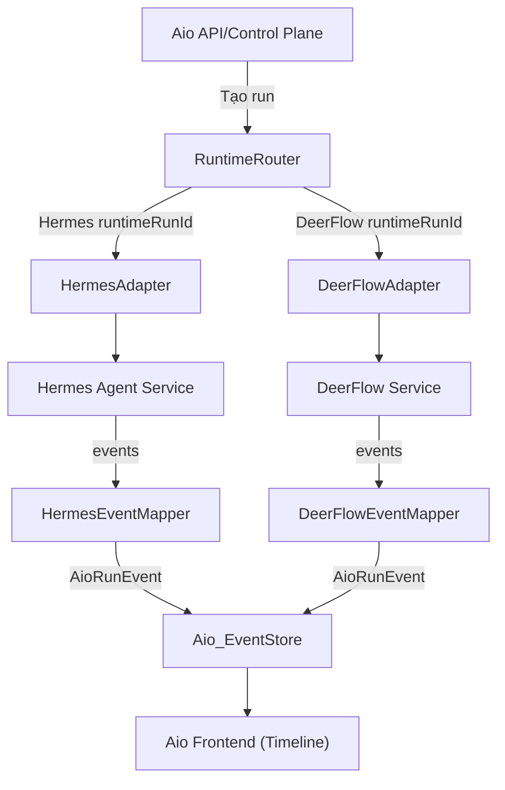
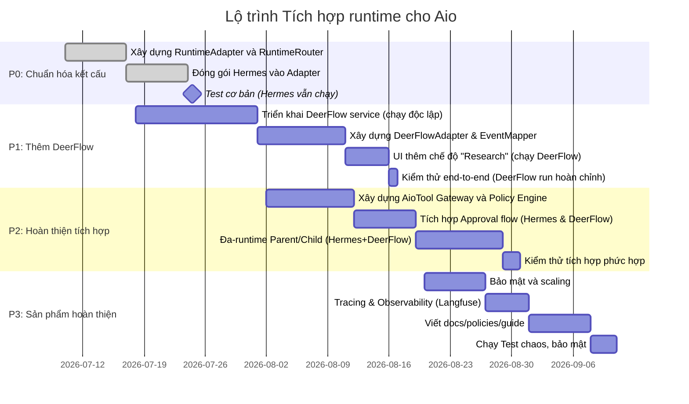

# Tóm tắt Kiến trúc và Giải pháp

Aio không nên xây **1 agent/runtime duy nhất**, mà hoạt động như **một nền tảng điều phối** (control plane) cho nhiều engine agent chuyên biệt. Sau khi khảo sát, những giải pháp **harness/agent** chính hiện nay đáng cân nhắc là:

- **DeerFlow** (ByteDance) – Open-source “SuperAgent” cho nhiệm vụ nghiên cứu/deep tasks, có UI đầy đủ, sub-agents, sandbox, skills. (75.9k ⭐, Python/TS, MIT)  
- **Hermes Agent** (Nous Research) – Open-source agent cá nhân/tự học, có lịch biểu tác vụ, multi-session memory, đa kênh (TUI/Web/Telegram). (208k ⭐, Python/TS, MIT)  
- **Onyx** (Trendshift) – Open platform cho RAG và tìm kiếm tri thức, tập trung nhiều connector dữ liệu, RBAC/SaaS-ready (30.7k ⭐, Node/Python).  
- **OpenHands** – Hệ sinh thái coding agent (79k ⭐ trên UI repo, MIT), hỗ trợ sandbox Docker, event stream, model-agnostic, cho tác vụ lập trình tự động.  
- **OpenManus** (Henry Alps) – Minh họa open-source dự án “Manus”, đơn giản, multi-agent, CLI+Web (914 ⭐, Unlicense).  
- Ngoài ra: **LangChain/LangGraph** (framework), **Semantic Kernel/AutoGen** (Microsoft), **OpenAI Agents SDK**, **OpenClaw** (trước đây), tuy không phải sản phẩm hoàn chỉnh, có thể dùng làm tham chiếu.

**Khuyến nghị:** Chọn **DeerFlow** và **Hermes** làm 2 runtime chính bổ sung cho Aio. DeerFlow phù hợp nhiệm vụ nghiên cứu, report, slide (multi-step có sub-agent, memory, skills), còn Hermes phù hợp chat agent, automation dài hạn, profile-based personal AI. Onyx dùng làm backend tri thức/RAG, OpenHands làm coding agent engine. Aio đóng vai **control plane**: quản user/billing/permissions, còn DeerFlow/Hermes là “execution plane” qua layer adapter.  

  

## Bảng so sánh tổng quát

| Giải pháp    | **Sao GitHub** | **Ngôn ngữ**         | **Sub-agents & Skills** | **Sandbox & Tools**     | **Sẵn sàng Prod**        | **Multi-tenant**            | **Vai trò gợi ý**                 |
|--------------|---------------|----------------------|-------------------------|-------------------------|--------------------------|-----------------------------|------------------------------------|
| **DeerFlow** | 75.9k ⭐ | Python (76%), TS (15%) | Có (lead & sub-agents), kỹ năng đa dạng | Sandbox Docker, MCP tools integration, multi-tool | Có Docker/K8s scripts, UI, tracing | Cơ bản (login, cookie) nhưng thiếu RBAC/billing | Nghiên cứu sâu, báo cáo dài, slide deck |
| **Hermes**   | 208k ⭐ | Python (82%), TS (14%) | Có (skill tự học, memory, subagents) | Giao diện dòng lệnh, container isolation cho tools | Đang Beta, cài 1-chạm (local/Docker) | Đơn-user (mỗi agent cá nhân) | Chat/tự động hoá dài hạn, agent cá nhân      |
| **Onyx**     | 30.7k ⭐  | Node.js, Python      | Có Agent RAG, custom agents | Sandbox cho code, connectors MCP | Đầy đủ (Docker, K8s, Helm docs) | Hoàn chỉnh (SSO, RBAC, multi-tenant)   | CSDL nội bộ, RAG tìm kiếm            |
| **OpenHands**| 79.1k ⭐  | Python, Node.js      | Có event-stream, multi-agent    | Docker sandbox, browser tự động | Đang phát triển (beta), cloud SaaS | Chưa rõ (có enterprise version)     | Agent lập trình, tự động hóa repo  |
| **OpenManus**| 914 ⭐  | Python, NextJS      | Có (agents browser/coder…)      | Chưa rõ, sử dụng thư viện Python  | MVP/experiment (Docker Compose) | Không (đơn-lượt)           | Chỉ tham khảo ý tưởng đa-agent   |
| **Khác**     | –             | –                    | –                       | –                       | –                        | –                           | (LangChain, AutoGen, etc.)         |

**Chú thích:** “Sub-agents” là khả năng khởi tạo agent con song song. “Skills” nghĩa là các workflow/đặc tả có sẵn (kiến thức/tác vụ được cấu hình). “Sandbox & Tools” đánh giá liệu có chạy code/an toàn. 

  

# Đánh giá chi tiết

## 1. **DeerFlow (ByteDance)**

- **Maturity:** 75.9k ⭐, MIT, phát triển năng nổ (v2.0.0 ra 25/6/2026). Code chính bằng Python (76%) và TypeScript frontend (Next.js). Hoạt động dựa trên LangGraph orchestration (qua Gateway FastAPI).
- **Kiến trúc:** Nginx (2026) làm reverse proxy cho Frontend (3000) và Gateway (8001). Gateway tích hợp runtime (FastAPI + LangGraph), lưu thread state, SSE streaming. Có UI web (React) và cả TUI. Cấu hình tập trung file (`config.yaml`, `extensions_config.json`).
- **Tính năng:** Hỗ trợ **multi-agent**: “lead agent” điều phối nhiều sub-agent riêng biệt. Hệ thống *Skill* phong phú (report, slide, research…). Memory (personal + thread). Toolbox (hàng chục tool chuẩn gồm web search, browser, file ops). Sandbox container hoá cho tool như `exec`. Trace đầy đủ qua Langfuse/LangSmith tích hợp. 
- **Prod-readiness:** Có hướng dẫn Docker/K8s, config file rõ. Tuy nhiên DeerFlow được thiết kế ban đầu cho mạng tin cậy (localhost). Không có auth mạnh (mới login/register căn bản), không mặc định phân quyền/billing. Chưa có rate-limiting “built-in” (phải thêm Nginx layer). Mô hình **gateway một tiến trình đơn** (single worker) có thể là nghẽn khi scale. Cần cầu nối (adapter) nếu dùng làm service ngoài.
- **Bảo mật:** Tự cảnh báo **không deploy public** không qua proxy/allowlist. Có sandbox hóa code và file, nhưng quyền thực thi hệ thống vẫn mạnh. Cần thêm Gate/RBAC phía ngoài, cơ chế phê duyệt lệnh nguy hiểm.
- **Khả năng mở rộng:** Hiện chưa clustering: run state lưu trong process Gateway. SSE streaming yêu cầu sticky session. Ko có đám mây multi-worker ready. Chi phí chủ yếu CPU/RAM cho model và sandbox containers.
- **Cộng đồng:** Lượng lớn developers, issue/PR sôi động, đóng góp nhanh. Tài liệu chi tiết (README, docs về kiến trúc, backend API).
- **Vai trò:** Rất thích hợp làm **research/workflow engine**. Dùng cho tác vụ đòi hỏi ghi nhớ, đa bước, nhiều agent con: ví dụ *“nghiên cứu thị trường AI tại Việt Nam – tạo report/slides”*. **Aio nên chạy DeerFlow qua adapter** để tận dụng kỹ năng nghiên cứu sâu, tránh cố gắng ép vào Hermes.


## 2. **Hermes Agent (Nous Research)**

- **Maturity:** 208k ⭐, MIT, nhiều phiên bản (v0.18.0 – Jul 1 2026). Code Python (82%) và TS UI (14%). Được quảng bá là “self-improving agent”, với vòng lặp học tích hợp (học từ trải nghiệm, tạo self-skill…).  
- **Kiến trúc:** Bản chất một agent cá nhân. Chạy dưới dạng tiến trình có **Messaging Gateway** và CLI/TUI. Hỗ trợ đa nền tảng (Telegram, Discord, Slack, WhatsApp, email) qua một **gateway** duy nhất. Lệnh điều khiển qua `hermes` CLI. Lưu session và memory vào SQLite/FTS5 search. Có scheduler nội tại (cron-like).
- **Tính năng:** Tích hợp **học (self-improve)**: tự tạo kỹ năng mới, self-summary, knowledge graph người dùng (Honcho). Đa công cụ: web search, image, coding, MCP… (có “Tool Gateway” điều phối qua sub-agent). Tích hợp mã nguồn mở (Claude Code, Codex CLI, OpenHands) làm skill. Sandbox: đặt tool trong container (ví dụ, chạy terminal lệnh trong Docker). Kênh persistent memory (ngôn ngữ tự nhiên).
- **Prod-ready:** Có một-click installer, support Docker Compose (có `docker-compose.yml`). Có documentation (hermes portal docs). Cho phép deploy ở nhiều backend (AWS, Container). Mặc định tự hoạt động như user-bot cá nhân. Không có sẵn khái niệm multi-user; mỗi deployment gắn với 1 **workspace (user)**.  
- **Bảo mật:** Xây dựng có tính đến sandboxing: tool được chạy trong container ngăn chặn (docker cap-drop no-new-privs). Có cơ chế phê duyệt lệnh (command approval, DM pairing). Tuy nhiên, nếu cho người ngoài sử dụng, cần tách riêng user bằng gateway và xác thực.  
- **Mở rộng:** Không thiết kế cho multi-tenant hoặc cluster: chủ yếu dành cho một agent/server. Có thể chạy nhiều agent riêng biệt cho nhiều user (mỗi agent lưu DB riêng). Tính mở rộng phụ thuộc vào phần cứng chạy model.  
- **Cộng đồng:** Rất hoạt động, thường xuyên release, docs phong phú (portal, CLI, skill hub).  
- **Vai trò:** Phù hợp cho *chat chính*, *automation dài hạn*, *agent profile-based*. Nên duy trì làm **runtime tự động hóa** (HermesRuntimeAdapter) cho user agent tasks. Không nên kỳ vọng Hermes thay DeerFlow về tính năng nghiên cứu sâu; nó mạnh về giữ trạng thái/lịch làm việc cá nhân.


## 3. **Onyx (Trendshift)**

- **Maturity:** 30.7k ⭐, Apache License. Code Node.js/TS (frontend) và Python (backend). Được thiết kế như “AI Platform” (chat/RAG/collaboration).  
- **Tính năng:** Tập trung vào **RAG và knowledge management**: hybrid index (vector + keyword), web search tích hợp, code execution, tạo artifact (doc, graph), voice interface, image gen. Hỗ trợ >50 connector (notion, github, confluence…) và MCP servers, cho phép agent truy cập ứng dụng bên ngoài. Multi-step “deep research” flows. Mô hình và tools chọn linh hoạt. Có giao diện chat UI ready.  
- **Prod-ready:** Có cả hai mode: *Lite* (UI nhẹ, ~1GB) và *Standard* (full-stack: DB, Redis, MinIO, worker, ML servers). Hướng dẫn triển khai Docker, K8s/Helm, cloud (Azure, AWS). Hỗ trợ SSO/OIDC/SAML và RBAC (enterprise). Tổng quan chuẩn SaaS multi-tenant.  
- **Bảo mật:** Enterprise-ready: audit, RBAC, user/org theo chuẩn. Hỗ trợ nhiều user, team. Code execution sandbox có sẵn. Thích hợp cho dữ liệu nhạy cảm (VD: CEO Nội dung).
- **Mở rộng:** Dễ mở rộng bằng container/K8s. Đã dùng Redis caching, blob storage. Hỗ trợ scaling worker node.  
- **Cộng đồng:** Đang rất được quan tâm, có cloud service miễn phí. Tài liệu rõ ràng (docs.onyx.app).
- **Vai trò:** Hoàn hảo làm **kiến thức nội bộ / RAG backend** cho Aio. Aio có thể gọi Onyx API hoặc cài onyx cùng cơ sở hạ tầng. Dùng cho truy vấn docs/cSDL/tài liệu tổ chức. (Không dùng Onyx thay Hermes/DeerFlow, mà phối hợp: Hermes/DeerFlow tạo agent, Onyx cung cấp data).


## 4. **OpenHands (OpenHands.org)**

- **Maturity:** Hệ sinh thái lớn: Agent Canvas (UI) 79k ⭐; SDK mã nguồn 858 ⭐. Nguồn MIT, được đầu tư (Series A, ~68k stars ghi nhận).  
- **Tính năng:** Được thiết kế riêng cho *các nhiệm vụ lập trình tự động*. Cấu trúc sự kiện (event stream): User→Agent→LLM→Action→Runtime (sandbox)→Observation. Hỗ trợ bất cứ model nào (LiteLLM: 100+), container Docker by default, tự động nén ngữ cảnh. Action phong phú: CmdRun, FileWrite, WebBrowse (Playwright). Tích hợp Browser tự động (Playwright). Gồm CLI (`oh`), SDK Python, UI (Agent Canvas React + FastAPI). Multi-agent, đa môi trường (Docker, Kubernetes, Modal cloud). Có MCP, auth.  
- **Prod-ready:** Đang beta/V2: có CLI, container compose. Hướng dẫn triển khai (docker-compose, K8s). Các tính năng Sandbox, docker-enforced đã có. Enterprise có K8s + RBAC. Vẫn đang cập nhật.  
- **Bảo mật:** Chạy container theo mặc định (cap-drop), phân tích lệnh nguy hiểm qua LLM. Có cơ chế phê duyệt khi cần.  
- **Mở rộng:** Thiết kế phân tán: runtime agent có thể chạy trên nhiều node (Docker/K8s/Modal). Truyền sự kiện qua API/pubsub.  
- **Cộng đồng:** Mới nổi, có repo lớn, đang phát triển tích cực (npm, docs hiện vẫn cập nhật).  
- **Vai trò:** Sử dụng như **coding engine**: khi Aio cần tác vụ lập trình phức tạp (ví dụ tạo/mở PR, refactor code, phân tích repo). Nếu Aio tích hợp OpenHands, sẽ làm `OpenHandsRuntimeAdapter`. Nếu chưa, có thể dùng như tham khảo cho tính năng coding agent.


## 5. **OpenManus**

- **Maturity:** 914 ⭐, Unlicense. Mô phỏng AI Manus, rất mới, chủ yếu là demo.  
- **Tính năng:** Demo multi-agent cơ bản: “coordinator.py”, “browser_agent”, “coder_agent”, “reporter_agent”, “research_agent”. Có UI (Next.js) và API (FastAPI). Hỗ trợ `/task` qua REST như ví dụ CLI.  
- **Prod-ready:** Rất đơn giản, chạy qua Docker Compose single-container. Thiếu nhiều: không sandbox code, không memory bền vững, không tính năng lớn.  
- **Vai trò:** Có thể coi là ý tưởng tham khảo. Không nên dùng làm runtime chính.  


## 6. **Các nền tảng khác (LangChain/LangGraph, AutoGen, Agents SDK, Semantic Kernel…)**

Các công cụ này **không phải platform hoàn chỉnh** mà chủ yếu cung cấp thư viện (LangChain, LangGraph) hoặc SDK (Semantic Kernel – MS). Ví dụ, LangGraph cung cấp mô hình orchestration đa-tác-vụ (sẽ có liên quan đến DeerFlow), Microsoft AutoGen/SK tập trung trên planner + worker + plugin. Còn Agents SDK của OpenAI hiện chưa thành sản phẩm mã nguồn mở lớn, khó đánh giá tích hợp. Chúng ta không xếp hạng như “runtime” độc lập, mà có thể dùng để xây thêm tính năng hoặc tham khảo.

  

# Xếp hạng và Khuyến nghị (Top 6)

1. **DeerFlow (ByteDance)** – *Runtime nghiên cứu chuyên sâu.* Rất mạnh cho các tác vụ multi-agent dài hạn. Ưu điểm: kỹ năng chuẩn bị sẵn, sub-agent orchestration, GUI, tracing. Nhược: không multi-tenant sẵn, cần gateway bổ sung. **Khuyến nghị:** Dùng làm **runtime bổ sung**, chỉ cho những tác vụ research/report. Kết hợp với Hermes qua adapter.  

2. **Hermes Agent (Nous)** – *Runtime chat/automation.* Mạnh về memory cá nhân, skill tự học và đa nền tảng (bot/gateway). Ít phù hợp cho deep research. Duy trì làm **runtime chính hiện tại**.  

3. **Onyx (Trendshift)** – *Knowledge engine / RAG.* Không dùng để thay agent, mà làm backend tri thức. Đặc biệt tốt cho tìm kiếm, index tài liệu công ty. Dễ tích hợp qua REST/SDK.  

4. **OpenHands** – *Coding engine.* Rất mạnh cho lập trình tự động, event-driven, sandbox sẵn. Tuy đội ngũ dev cần xem xét maturity (SDK mới), nhưng xếp thứ 4 vì 68k⭐ (UI). Dùng khi Aio cần lập trình phức.  

5. **OpenManus** – *Demo agent.* Hạn chế (914⭐, chưa stable). Dùng như tham khảo ý tưởng, không tích hợp chính.  

6. **LangChain/LangGraph/AutoGen** – *Framework layers.* Tích hợp LangGraph (qua DeerFlow) tốt cho workflow. Semantic Kernel/AutoGen chưa đủ ready. Xếp theo Team chỉ cho tham khảo và nghiên cứu, không trực tiếp dùng làm runtime.

  

# Sơ đồ Adapter Kiến trúc (Aio)



**Giải thích:** Khi người dùng tạo tác vụ, Aio API quyết định chạy trên **Hermes** hay **DeerFlow** (RuntimeRouter). Các runtime adapter đảm nhận việc gọi API hoặc SDK tương ứng và chuyển đổi mọi sự kiện thành `AioRunEvent`. UI Aio chỉ xử lý `AioRunEvent` chung, không cần biết runtime cụ thể.

  

# Blueprint Tích hợp (Top 2: DeerFlow & Hermes)

## Adapter Interface

```ts
// apps/web/src/lib/aio/runtime/runtime-adapter.ts

export type RuntimeName = "hermes" | "deerflow";

export type CreateRunInput = {
  userId: string;
  workspaceId: string;
  prompt: string;
  mode?: "chat" | "research" | "automation";
  files?: Array<{ id: string; name: string; url: string }>;
};

export type CreateRunResult = {
  aioRunId: string;
  runtime: RuntimeName;
  runtimeRunId: string;
};

export interface RuntimeAdapter {
  name: RuntimeName;
  createRun(input: CreateRunInput): Promise<CreateRunResult>;
  streamEvents(input: { runtimeRunId: string }): AsyncIterable<AioRunEvent>;
  stopRun(input: { runtimeRunId: string }): Promise<void>;
  respondApproval?(input: {
    runtimeRunId: string;
    approvalId: string;
    decision: "approve" | "reject";
  }): Promise<void>;
  getArtifacts(input: { runtimeRunId: string }): Promise<AioArtifact[]>;
}

export type AioRunEvent =
  | { type: "run.created"; runId: string; createdAt: string }
  | { type: "message.delta"; runId: string; delta: string; createdAt: string }
  | { type: "tool.started"; runId: string; toolName: string; createdAt: string }
  | { type: "tool.completed"; runId: string; toolName: string; createdAt: string }
  | { type: "approval.requested"; runId: string; approvalId: string; createdAt: string }
  | { type: "artifact.created"; runId: string; artifactId: string; name?: string; url?: string; createdAt: string }
  | { type: "run.completed"; runId: string; createdAt: string }
  | { type: "run.failed"; runId: string; error: string; createdAt: string }
  | { type: "run.cancelled"; runId: string; createdAt: string };
```

**Ví dụ ánh xạ sự kiện:** Nếu DeerFlow trả SSE event `{ event: "thread_message_delta", data: { thread_id, message } }`, DeerFlowAdapter sẽ chuyển thành `{ type: "message.delta", runId: <aioRunId>, delta: <text>, createdAt }`. Tương tự Hermes event `{ type: "ToolResult", payload }` sẽ thành `tool.completed`.

  

## Bố cục Sandbox và File

- **Workspace per-run:** Mỗi run tạo thư mục riêng trên host (hoặc volume). Ví dụ:  
  `/data/aio/workspaces/{workspaceId}/runs/{runId}/hermes/` và `.../deerflow/`.  
- **Tools container:** Khởi docker container để chạy code/terminal. Ví dụ, DeerFlow sử dụng `AioSandboxProvider` (docker). Hermes dùng container chạy command.  
- **Artifact lưu ở server:** Tương tự path trên, mọi output (file, logs) được lưu. Aio UI cung cấp link tải artifact (serve qua nginx, đảm bảo `content-disposition: attachment`).

## Cơ sở Dữ liệu (Schema ví dụ)
```sql
-- Bảng lưu Run chính của Aio
CREATE TABLE aio_runs (
  id TEXT PRIMARY KEY,     -- <UUID run>
  workspace_id TEXT,
  user_id TEXT,
  runtime TEXT,            -- "hermes" hoặc "deerflow"
  runtime_run_id TEXT,     -- ID do runtime (Hermes/DeerFlow) cấp
  status TEXT,             -- running/completed/failed/cancelled
  title TEXT,              -- task mô tả
  cost_estimate REAL,
  cost_final REAL,
  created_at TIMESTAMP,
  updated_at TIMESTAMP
);

CREATE TABLE aio_run_events (
  id SERIAL PRIMARY KEY,
  run_id TEXT REFERENCES aio_runs(id),
  event_type TEXT,
  payload JSONB,
  created_at TIMESTAMP DEFAULT NOW()
);

CREATE TABLE aio_artifacts (
  id SERIAL PRIMARY KEY,
  run_id TEXT REFERENCES aio_runs(id),
  runtime TEXT,
  name TEXT,
  mime_type TEXT,
  url TEXT,
  created_at TIMESTAMP DEFAULT NOW()
);

CREATE TABLE aio_approvals (
  id TEXT PRIMARY KEY,
  run_id TEXT REFERENCES aio_runs(id),
  runtime TEXT,
  status TEXT,           -- pending/approved/rejected
  payload JSONB,
  requested_at TIMESTAMP,
  responded_at TIMESTAMP
);
```

- **Thuật ngữ:** `run_id` (Aio) và `runtime_run_id` (Hermes/DeerFlow) được liên kết.  
- Aio ghi nhận toàn bộ `AioRunEvent` vào bảng `aio_run_events`. UI sẽ query dòng lệnh theo `run_id`.  

  

## Triển khai (Docker/K8s)

- **Các service:** Tách biệt 3 thành phần:  
  - `aio-api` (Node.js Fastify) – server Aio control plane.  
  - `hermes-runtime` (Python) – Hermes Agent service.  
  - `deerflow-runtime` (Python + Nodejs) – DeerFlow Gateway & Agent.  
- **Docker Compose ví dụ:**

```yaml
version: "3.8"
services:
  aio-api:
    image: mycompany/aio-api:latest
    ports: ["3000:3000"]
    env_file: .env.aio
    depends_on:
      - aio-db
      - hermes-runtime
      - deerflow-runtime

  aio-db:
    image: postgres:15
    environment:
      POSTGRES_DB: aio
      POSTGRES_USER: aio
      POSTGRES_PASSWORD: changeme
    volumes:
      - db-data:/var/lib/postgresql/data

  hermes-runtime:
    image: nousresearch/hermes-agent:latest
    ports: ["8001:8001"]
    env_file: .env.hermes
    volumes:
      - ./workspace:/workspace
  
  deerflow-runtime:
    image: bytedance/deer-flow:latest
    ports: ["8002:8002"]
    env_file: .env.deerflow
    volumes:
      - ./workspace:/mnt/user-data

volumes:
  db-data:
```

- **Kubernetes:** Tương tự, deploy từng deployment/Service riêng. Đặt `RuntimeAdapter` trong Aio chỉ gọi qua HTTP (Hermes 8001, DeerFlow 8002). Dùng Ingress/gateway (nginx) nếu cần.  
- **Bảo mật:** Đặt Aio API phía trước, giới hạn truy cập DeerFlow/Hermes chỉ qua Aio API. Thiết lập xác thực Aio (mô hình người dùng), rate-limit (e.g. API Gateway + Fastify middleware), CSRF, CORS đúng quy định. 

## Kiểm soát an toàn

- **Tool Gateway:** Các runtime không được tự gọi tool nguy hiểm. Tốt nhất là qua **Aio Tool Gateway** trung gian, kiểm soát danh sách tool cho phép và phê duyệt nếu cần. Ví dụ khi DeerFlow muốn chạy `docker rm -rf`, chỉ được phép sau khi Aio phê duyệt.  
- **Approval Flow:** Mỗi lệnh nguy hiểm (deploy, fs.modify, internet access) sinh record ở `aio_approvals`. UI hiển thị thẻ phê duyệt. Runtime chỉ thực thi tool sau khi `respondApproval` có kết quả.  
- **Rate Limit:** Triển khai giới hạn truy vấn vào Aio API dựa trên user/billing. Ví dụ chỉ cho 5 run đồng thời, 100 token/phút. Nginx hoặc middleware Node có thể bảo vệ API.  
- **Tenant Isolation:** Mỗi workspace/user có thư mục và DB riêng (ví dụ: schema Postgres row_level_security). Tránh runtime đọc nhầm dữ liệu người khác.  

  

# Lộ trình (Roadmap)



**Milestone:**  
- P0: RuntimeAdapter hoàn thành, Hermes hoạt động qua Aio.  
- P1: DeerFlow chạy song song, UI hỗ trợ.  
- P2: Công cụ/phê duyệt thống nhất, multi-runtime orchestration.  
- P3: Tinh chỉnh an toàn, theo dõi, document hoá, triển khai.

**Acceptance:** Mỗi giai đoạn cần test unit & integration (ví dụ mock runtime, test mapping event). Test chaos (đột ngột dừng worker, full disk, network failure). Security review (punch list: CSRF, injection, sandbox escape, rate-limit). Tính chi phí (AI API): Ước lượng token cho mỗi run (ví dụ DeerFlow một report cỡ trung bình ~X token), tính dựa theo volume người dùng. Hạ tầng: CPU/RAM cho model server, sandbox containers. 

**Chi phí:** Chưa rõ **licensing** (open-source) nhưng cần tài nguyên: Mô hình LLM trả phí (OpenAI, vLLM), dung lượng lưu trữ tài liệu. Kinh phí hạ tầng (container, k8s) tuỳ theo QPS. Sẽ cần subscription GPT/Claude, hoặc tự host model (Ollama), hạ tầng redis/db. 

**Vai trò Nhóm:** 
- **Dev backend:** Xây adapter, router, tích hợp runtime, DB, APIs. 
- **Dev frontend:** UI timeline, run controls, chạy/stop, approval UI. 
- **DevOps:** Triển khai Docker/K8s, monitoring, CI/CD. 
- **Security:** Audit code, thiết lập mạng an toàn, rate-limit. 
- **QA:** Viết test, tự động kiểm thử. 

**Không làm:** Đừng cắm DeerFlow trực tiếp cho UI (luôn qua Aio API). Đừng tạo “1 run = 2 runtime đồng thời” ngay (chỉ orchestration trong Aio, từng runtime một lúc). Tránh cho frontend biết sự khác biệt giữa Hermes/DeerFlow.  

**Nguồn:** Các đánh giá trên dựa trên tài liệu chính thức của DeerFlow, Hermes, Onyx, OpenHands và OpenManus.